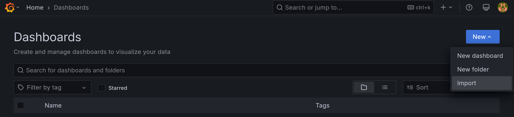

Configure prometheus to pull metrics from your Icebreaker server and port.

/etc/prometheus/prometheus.yml

eg.

```yaml
global:
  scrape_interval:     15s # By default, scrape targets every 15 seconds.
  external_labels:
    monitor: 'codelab-monitor'

scrape_configs:

  - job_name: 'icebreaker'
    scrape_interval: 5s
    static_configs:
      - targets: ['mainnet-relay2:3000']
```

In Grafana, on the Dashboards page, click New -> Import and paste the contents of icebreaker.json into the "Import via dashboard JSON model" field.


